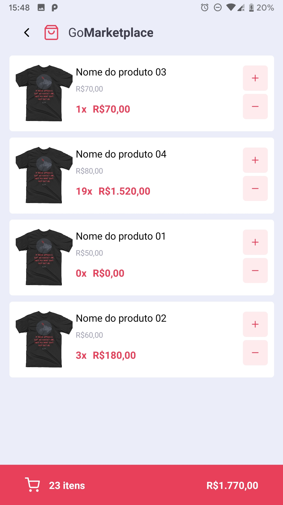
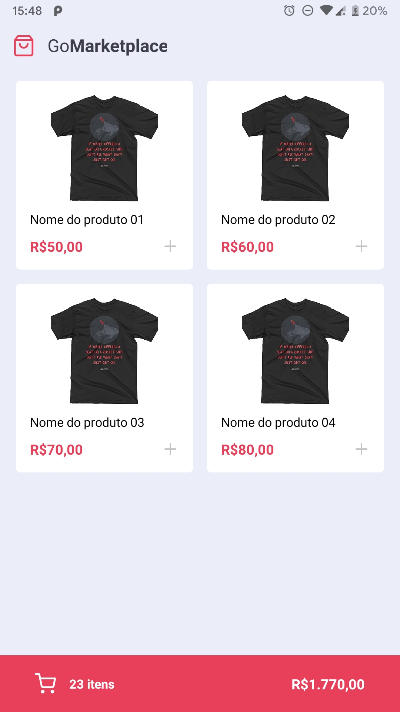

# Challenge 08 GoStack - GoMarketPlace

An app made with React Native and Typescript using routes, Async Storage and context API concepts.


[](https://github.com/cesarramos95/gostack-challenge-gomarketplace/blob/master/LICENSE)
&logo=<LOGO>">


## 💻 Preview

<br>
<div align="center">
  
  
</div>

<div id="technologies">

<p align="center">
 <a href="#technologies">Technologies</a> •
 <a href="#run">How to run</a> •
 <a href="#license">License</a> •
 <a href="#autor">Autor</a>
</p>

---

## 🛠 Technologies
The following tools were used to solve this challenge:
- [React Native](https://reactnative.dev/)
- [TypeScript](https://www.typescriptlang.org/)

</div>

<div id="install">

---

## ℹ How to run

### Requirements

- [React Native](https://reactnative.dev/)
- [Yarn](https://yarnpkg.com)
- [Git](https://git-scm.com)

Clone the repository and install the dependencies:

```bash
# To clone the repository
$ git clone https://github.com/cesarramos95/gostack-challenge-gomarketplace

# To acess the folder
$ cd gostack-challenge-gomarketplace

# Install dependencies
$ yarn

# To run fake API
$ yarn json-server server.json -p 3333
```

To run the application on your device you need to configure your IP on [api.ts](./src/services/api.ts) file:

```shell
baseURl: 'http://<your machine's ip>:3333'
```

You can use baseURL:'http://localhost:3333'. To this, run the command below:

```shell
adb reverse tcp:3333 tcp:3333
```
</div>

<div id="license">

---

## 📝 License
This repository is under [MIT](./license) license.
</div>

<div id="autor">

## Autor


<br>
<a href="t.me/cesarramos95">César</a>

[](https://www.linkedin.com/in/cesararamos/)
[](mailto:cesarramos.aug@gmail.com)

</div>

---

Made with ❤ by César 👋 [Get in touch!](https://linkedin.com/in/cesararamos)

